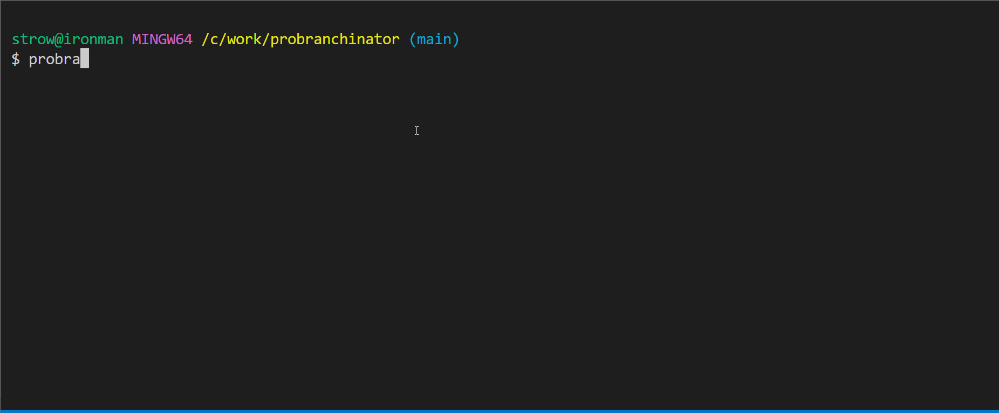

# probranchinator

This is a CLI tool that compares all branches in repository and displays how they can be merged to each other.



## Installation

Download a binary from [latest release](https://github.com/strowk/probranchinator/releases) and put it somewhere in your `$PATH`.

Tool requires `git` CLI to be installed and available in `$PATH`.

## Usage

```bash
probranchinator --remote=<remote_url>
```

Example:

```bash
probranchinator --remote=https://github.com/strowk/probranchinator
```

If you want to examine your local repository, you can use `file://` protocol:

```bash
probranchinator --remote=file://$PWD
```

To exit the program, press `q`.

## How it works

1. Clones remote repository into temporary local repository (if necessary)
2. Fetches all branches from remote
3. Compares all branches with each other
4. Outputs result in terminal

